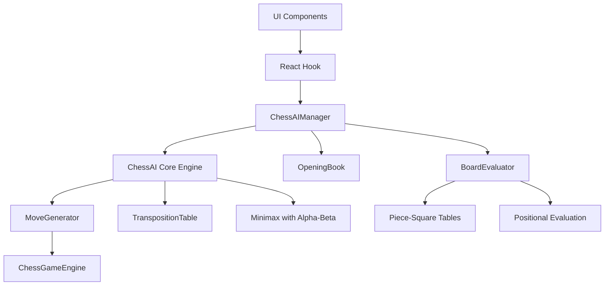

# Chess AI Engine

Advanced chess AI implementation using Minimax algorithm with Alpha-Beta pruning, optimized for performance and configurable difficulty levels.

## Architecture



## Core Components

### ChessAI
Main search engine implementing:
- Minimax algorithm with Alpha-Beta pruning
- Iterative deepening for time management
- Quiescence search to avoid horizon effect
- Move ordering for optimal pruning

### BoardEvaluator
Advanced position evaluation featuring:
- Material balance calculation
- Piece-square tables for positional values
- King safety evaluation
- Pawn structure analysis
- Mobility and center control

### MoveGenerator
Optimized move generation with:
- Legal move validation
- Special move handling (castling, en passant, promotion)
- Capturing move filtering for quiescence search
- Algebraic notation generation

### TranspositionTable
Performance optimization through:
- Zobrist hashing for position identification
- Efficient caching of evaluated positions
- Memory management with LRU cleanup
- Statistics tracking for hit rates

### OpeningBook
Early game optimization with:
- Common opening sequences
- Response variations
- General opening principles
- Development prioritization

## Usage

### Basic Integration

```typescript
import { useChessAI, AIDifficulty } from '../hooks/useChessAI';

function ChessGame() {
  const ai = useChessAI(AIDifficulty.INTERMEDIATE);
  
  const handleAIMove = async () => {
    const move = await ai.findBestMove(gameState);
    if (move) {
      // Apply move to game state
      handleMove(move);
    }
  };
  
  return (
    <div>
      <button onClick={handleAIMove} disabled={ai.state.isThinking}>
        {ai.state.isThinking ? 'AI Thinking...' : 'Get AI Move'}
      </button>
      
      {ai.state.lastStats && (
        <div>
          Evaluation: {ai.state.lastStats.evaluation}
          Time: {ai.state.lastStats.timeUsed}ms
          Depth: {ai.state.lastStats.depth}
        </div>
      )}
    </div>
  );
}
```

### Advanced Configuration

```typescript
// Set AI personality
ai.setPersonality({
  aggression: 0.8,
  development: 0.7,
  safety: 0.4,
  material: 0.6,
  positional: 0.5
});

// Update AI settings
ai.updateConfig({
  maxDepth: 5,
  maxThinkTime: 10000,
  useOpeningBook: true
});

// Get position analysis
const analysis = await ai.getPositionAnalysis(gameState);
console.log(analysis.description); // "White has a slight advantage"
console.log(analysis.threats);     // ["King is in check"]
console.log(analysis.opportunities); // ["Fork available on f7"]
```

### AI vs AI Games

```typescript
import { useAIvsAI } from '../hooks/useChessAI';

function AIBattle() {
  const aiGame = useAIvsAI();
  
  const startGame = () => {
    aiGame.startAIGame(
      initialGameState,
      (move) => console.log('Move played:', move.notation),
      (result) => console.log('Game ended:', result)
    );
  };
  
  return (
    <button onClick={startGame}>
      Start AI vs AI Game
    </button>
  );
}
```

## Difficulty Levels

| Level | Depth | Time Limit | Features |
|-------|-------|------------|----------|
| Beginner | 2 | 1s | Basic search, no opening book |
| Intermediate | 3 | 3s | Opening book enabled |
| Advanced | 4 | 5s | All features, good evaluation |
| Expert | 5 | 8s | Deep search, strong play |
| Master | 6 | 15s | Maximum strength |

## Performance Optimizations

### Search Optimizations
- **Alpha-Beta Pruning**: Reduces search tree by 80-90%
- **Move Ordering**: Captures and checks first for better pruning
- **Iterative Deepening**: Progressive depth increase with time management
- **Quiescence Search**: Extends search for tactical sequences

### Memory Optimizations
- **Transposition Table**: Avoids redundant position evaluations
- **Zobrist Hashing**: Efficient position encoding
- **Memory Cleanup**: Automatic cleanup of old entries

### Evaluation Features
- **Piece-Square Tables**: Positional piece values
- **King Safety**: Protection and exposure analysis
- **Pawn Structure**: Doubled, isolated, and passed pawns
- **Mobility**: Piece activity and center control

## AI Personalities

Predefined personality profiles affect playing style:

### Aggressive
- High attack priority
- Risk-taking in exchanges
- Quick development
- Sacrificial play for initiative

### Positional
- Long-term planning
- Pawn structure emphasis
- Piece coordination
- Strategic maneuvering

### Tactical
- Pattern recognition
- Combination seeking
- Material focus
- Sharp play

### Defensive
- King safety priority
- Solid pawn structure
- Cautious exchanges
- Counter-attack preparation

## Integration Examples

### Move Suggestions
```typescript
const suggestions = await ai.getSuggestedMoves(gameState, 3);
suggestions.forEach(suggestion => {
  console.log(`${suggestion.move.notation}: ${suggestion.description}`);
});
```

### Position Evaluation
```typescript
const evaluation = ai.evaluatePosition(gameState);
const shouldResign = ai.shouldResign(gameState);
const shouldDraw = ai.shouldOfferDraw(gameState);
```

### Real-time Analysis
```typescript
const candidates = await ai.analyzePosition(gameState, 5);
candidates.forEach(candidate => {
  console.log(`${candidate.move.notation}: ${candidate.evaluation}`);
});
```

## Performance Metrics

Typical performance on modern hardware:
- **Search Speed**: 50,000-200,000 nodes/second
- **Move Time**: 1-10 seconds depending on difficulty
- **Memory Usage**: 10-50 MB for transposition table
- **Opening Book**: Instant move selection from database

## Error Handling

The AI system includes comprehensive error handling:
- Fallback to simpler algorithms on search failure
- Timeout protection for long calculations
- Graceful degradation when memory limits reached
- Recovery from invalid move generation

## Future Enhancements

Planned improvements:
- Neural network evaluation integration
- Endgame tablebase support
- Time management refinements
- Multi-threaded search
- Cloud-based deep analysis
